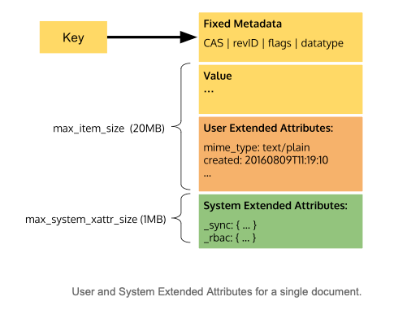

# Extended Attributes (xattr)

The following information is copied from
https://docs.google.com/document/d/18UVa5j8KyufnLLy29VObbWRtoBn9vs8pcxttuMt6rz8

## Document layout

## XATTR Features

1. An XATTR consists of a key/value pair.
2. The XATTR key (X-Key) is a Modified UTF-8 string up to 16 bytes in length.
    * X-Keys starting with the following characters are reserved and cannot be
      used:
        1. `ispunct()`, excluding underscore (!"#$%&'()*+,-./:;<=>?@[\]^`{|}~)
        2. `iscntrl()`
    * X-Keys starting with a leading underscore ('_', 0x5F) are considered
      system XATTRs and can only be accessed if the client holds the
      `SYSTEM_XATTR` read / write privilege.
    * X-Keys starting with a leading dollar sign (‘$’, 0x24) are considered
      virtual XATTRs and can only be accessed if the client holds the
      `XATTR_READ` privilege.
    * X-Keys not starting with a leading underscore (and not starting with a
      reserved symbol) are user XATTRs and may be changed by clients with the
      `XATTR_WRITE` privilege.
3. An XATTR value (X-Value) is a JSON value, as defined by http://www.json.org
4. A Virtual Attributes (VATTR) is an attribute which isn’t directly stored
   within the document, but may reflect other properties related to the
   document. See Appendix E: Virtual XATTRS
5. XATTR lifetime:
    * User XATTRs share lifetime with the document body - i.e. when a Document
      is deleted its XATTRs are deleted alongside the body.
    * System XATTRs share lifetime with the document metadata - i.e. when a
      Document is deleted its system XATTRs are preserved in the Tombstone -
      see Soft Deletion. When the tombstone is purged, system XATTRs are
      removed.
6. XATTR size limits:
    * User XATTRs share the same item limit (`max_item_size`) as the document
      body - i.e. You can store up to N bytes total of document body and user
      XATTRs for each Document.
    * System XATTRs are given their own per-document quota of (
      `max_system_xattr_size`). This ensures that even if a Document is at its
      maximum (value+user_xattr) limit, system, XATTRs can still be written.
      `max_system_xattr_size` is a global limit (as per document body limit).
    * An arbitrary number of XATTRs can be associated with a document, up to
      the per-document size limits.
7. XATTRs can be accessed using extensions to the binary protocol:
    * Virtual ATTRs can only be read.
    * XATTRs can be read and written individually.
    * XATTRs can be read atomically alongside the document body - i.e. read
      both the document body and an individual XATTR in a single request.
        1. XATTRs can be partially read atomically alongside the document body -
           i.e. read both a sub-part of the document body, and a sub-part of an
           XATTR in a single request, using an extended Sub-Document API.
    * XATTRs can be written atomically alongside the document body - i.e. write
      both body and an individual XATTR in a single atomic request.
        1. XATTRs can be partially written atomically alongside the document
           body - i.e. write both a sub-part of the document body, and a
           sub-part of an XATTR in a single request.
    * XATTRs can be deleted.
8. XATTRs mutations support macro expansion:
    * Specific strings inside an XATTR mutation request can optionally be
      expanded by the server during execution.
    * The following Macros are permitted:
        1. `${Mutation.CAS}` - Expands to the CAS value after mutation (i.e. the
           new CAS value of the document).
9. XATTRs can be streamed via DCP:
    * XATTRs by default are not included in the DCP stream - any existing
      clients will not be exposed to them.
    * Interested clients can opt-in to receiving XATTR information by using the
      new `XATTR` HELO flag. If this flag is negotiated, then the following new
      requests can be made:
    * DCP clients can request that XATTRs are included in the mutation &
      deletion stream by specifying the flag `DCP_OPEN_INCLUDE_XATTRS` as part
      of the DCP_OPEN request.
      If the `INCLUDE_XATTRS` flag is specified, whenever any of a Document
      changes (main document or XATTRs), a DCP_MUTATION will be generated
      including the XATTRs and the Value.
