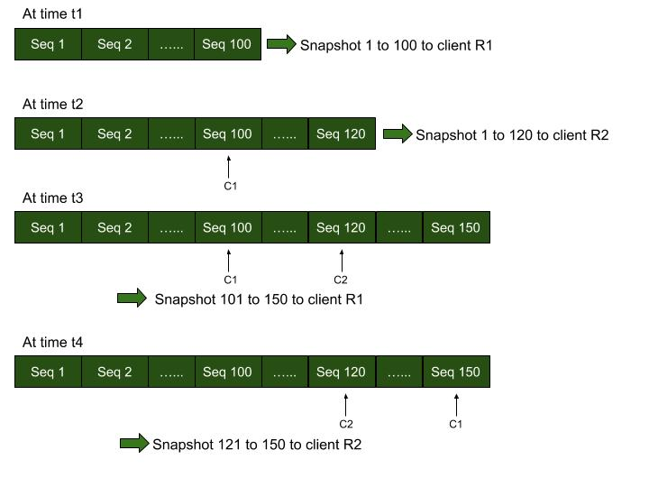

# Concepts

DCP is built on four major architectural concepts that allow the protocol to be used to build a rich set of applications. Below are the major concepts.

### Order

The first major concept is order and it is the foundation for the rest of the major architectural concepts. Order is important because it allow applications to reason about causality of data or in other words allows an application to know if an operation occurred before or after another operation. DCP achieves order through the use of sequence numbers and failover logs. Sequence numbers are used to keep order on a single node and failover logs are used to resolve ording conflicts during failure scenarios.

### Restartability

Restartability is an important feature for any replication protocol that often has to deal with large amounts of data. In any distributed system components crash and when your moving large portions of data applications want to be able to resume from exactly where they left off and not have to resend any data in the case of a dropped connection. Due to the DCPs ordering mechanism restartability is possible from any point and means the server won't send any data that the application has already received even if the application has been disconnected for an extended period of time.

### Consistency

Some applications can only make decisions about the data they receive if they have a consistent view of the data in the database. DCP provides consistency through snapshots and allow applications know that they have seen all mutations in the database up to a certain sequence number.

### Performance

DCP provides high throughput and low latency by keeping all of the most recent data that needs to be replicated in memory. This means that most DCP connection will never have to read data off of disk.

## Snapshots

Snapshots are very critical to achieve the above 4 architectural foundations of DCP.
up to
In the most basic sense, a snapshot (a full snapshot) is an immutable view of the KV store at an instance. This is also a consistent view of the KV store at that instance.

In Couchbase server, snapshot is an immutable copy of the key-value pairs in a vbucket (partition), received in a duration of time. That duration of time is marked by a 'start sequence number' and an 'end sequence number'. Successive snapshots give a consistent view of the vbucket up to a particular point, that is, till the 'end sequence number' of the last snapshot. Snapshots provide restartability when streaming items to replicas or other DCP clients. Snapshots also deduplicate multiple versions of the key by keeping only the latest value of the key.

There are two types of snapshots that are formed when streaming items from the Couchbase vbuckets. When a client connects to the source, it initially gets a 'disk snapshot', and later when the client catches up with the source and hence has reached the steady state, it starts getting 'point-in-time' snapshots from memory.

### Disk Snapshots
Disk snapshots are immutable persistent snapshots on the disk. They are formed after a batch of items are written onto disk. These snapshots persist on the disk until multiple such snapshots are compacted into a single snapshot. The replication clients then pick up these immutable snapshots and hence get a view of the vbucket that is consistent with the source vbucket. This is called as disk backill. When a disk backfill starts, all the snapshots are logically merged as and sent over as a single snapshot to the client. For example, say the disk has 3 snapshots snp1 from 1 to 20, snp2 from 21 to 30 and snp3 from 31 to 60. A backfill request will merge all 3 snapshots and send over a single logical snapshot from 1 to 60. And for request from the middle of the snapshot, that if the request is from sequence number 15, then the logical snapshot sent over is 15 to 60. Note that, to get a consistent view of the vbucket, the client should read till the end of the snapshot as some of the keys might have been de-duplicated.

A drawback of the disk snapshots is that the keys cannot be replicated until the snapshot is formed. They are good when the snapshots are fairly large, that is when replication clients picks up batch of items and when they are fine with the higher latency in being synced with the source.

### Point-in-time snapshots (in-memory snapshots)
Point-in-time snapshots are the snapshots that are created on the fly. That is, the source vbucket creates the snapshot only at the time when a replication client requests data. In Couchbase server, point-in-time snapshots are in-memory snapshots created by the checkpoint manager. They are best suited for steady state replication of items from memory. Steady state means all replication clients have almost caught with the source vbucket.

Below is an example how point-in-time snapshots give consistent view of the vbucket across multiple clients:

1) Say the source vbucket has items from sequence number 0 to 100 and a replication client R1 makes a request for the copy of data. Items from sequence number 0 to 100 are sent as a snapshot (point-in-time snapshot) to R1 and a cursor C1 that corresponds to the client R1 is marked on the checkpoint manager.

2) At a later time, say 20 more items are appended and hence the highest sequence number is 120. If another client R2 requests for data, items from sequence number 0 to 120 are sent as a snapshot to R2 and a cursor C2 that corresponds to the client R2 is marked on the checkpoint manager.

3) When more data is appended to the vbucket, say until sequence number of 150, the client R1 can get up to 150 in a successive point-in-time snapshot from 101 to 150.

4) The client R2 can get up to 150 in a successive point-in-time snapshot from 121 to 150.

Note that cursors C1 and C2 are important to start over quickly from where the clients R1 and R2 had left before. As the cursors move, the key-value pairs with sequence number less than the sequence number where any cursor is marked can be removed from memory.

Point-in-time snapshots are good for steady state replication as the replication clients can get their own snapshots that are created on demand and hence avoiding any wait for a snapshot to be created, thereby catching up with the source very fast with the latest key-value pairs shipped over as soon as possible.

Slow clients and lagging (deferred) clients do not work well with point-in-time snapshots. As we cannot eject from checkpoint manager (memory) the items with sequence number less than the sequence number of the cursor with the least sequence number, the slow clients can increase the memory usage. We handle such slow clients by dropping the respective cursors on the checkpoint manager and falling back to disk snapshots.

## Deduplication
Deduplication is removal of duplicate versions of the same key in a snapshot and retention of only the final version of the key in that snapshot.

In a Couchbase bucket, deduplication is done both in memory and on disks. In memory, deduplication is done when (1) an item update is written onto an open (mutable) checkpoint and (2) when multiple closed (immutable) checkpoints are merged into a single closed checkpoint. On disk, deduplication is done when multiple disk snapshots are compacted into a single disk snapshot during compaction. However, when multiple disk snapshots are merged logically into a single DCP backfill snapshot deduplication is not done.

In an Ephemeral bucket, deduplication is done periodically by removing stale copies and also when a backfill snapshot is formed.

## Streaming from a replica vbucket
DCP is a protocol which does master-slave replication. That is all the clients (slaves) get the copy of the data which is eventually consistent with the server vbucket (master).

So it is always best to stream data from an active vbucket which is the master in our model. However due to requirements like having additional redundancy some clients choose to stream from replica vbuckets (slaves) as well. Streaming data from slaves comes with some additional complexity on the server (DCP Producer).

Since the checkpoints on the server use [point-in-time snapshots](concepts.md#point-in-time-snapshots-in-memory-snapshots), the snapshots received by the replica vbuckets and the snapshots persisted by it need not be the same. This happens when the replica vbucket persists an incomplete point-in-time snapshot from the active vbucket. So while streaming data from the replica vbuckets we must combine disk snapshot and the point-in-time snapshot into one snapshot. A caveat here is that the replica vbucket might not have received all the items in the latest point-in-time snapshot, so the DCP client streaming from replica will have to wait till the replica gets all the items in the latest snapshot from the active.

Consider the below example:
1) Active vbucket is sending a point-in-time snapshot from 1 to 500, and has sent up to seqno 300. A key K1 might have a value of V1 at seqno 100 and a value of V1' at seqno 400. Now due to deduplication, the snapshot holds K1 only at seqno 400.

2) The replica vbucket persists the items from 1 to 300 as a disk snapshot.

3) A client tries to stream items from the replica vbucket and gets a disk snapshot of 1 to 300.

4) The disk snapshot from seqno 1 to seqno 300 is inconsitent because it does not contains an old or newer version of K1 at all.

5) Hence while streaming from the replica vbucket, we must combine the disk snapshot and the point-in-time snapshot being received by the replica vbucket as a single snapshot (from 1 to 500 in this case). Note that the client snapshot cannot be completely sent until the replica receives the snapshot from 1 to 500 fully from the active.

 
