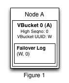
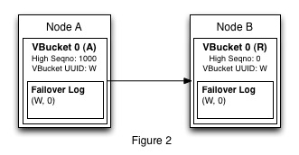
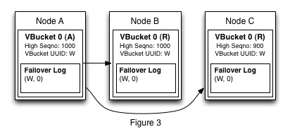
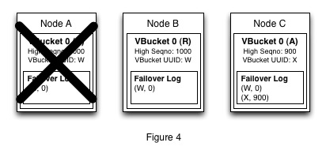
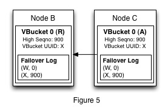

## Failure Scenarios

Failure scenarios are handled through the use of failover logs which are kept for all VBuckets no matter what state the VBucket might be in. A failover log consists of one or more entries and each entry contains a VBUcket UUID/High Seqno pair. Below is an example of a failover log.

1. (W, 0)
2. (X, 500)
3. (Y, 900)

In this document we will represent the VBucket UUID as a letter, but in practice the VBucket UUID will be represented as a random 64-bit value. The VBucket UUID can best be thought of as identifying a history of mutations. Every time the writer of the history changes we need to create a new failover log entry. We consider a change in history to occur whenever a VBucket changes it's state to active or whenever a node recovers from an unclean shutdown. When this happens an entry is created by generating a random VBucket UUID and associating it with the highest squence number contained in the VBucket.

#### Failover Log Behavior

In this section we will demonstrate how a failover log is used to deal with failure scenarios. Figure 1 shows the initial state of the cluster for this example failover scenario.

When a user first starts a Couchbase cluster they will do so by bringing up a single node. Figure 1 shows the state of the node immediately after warmup finishes. Node A contains a single VBucket (VBucket 0) in active state, with a random VBucket UUID (denoted as W) and a high sequence number 0. The VBucket also contains a failover log with one entry. This entry is added to the failover log when the VBuckets state is set to active. All entries to the failover log will  contain the VBucket UUID/High Seqno pair of the VBucket at the time the state was set. As such VBucket 0 will contain (W,0) as it's failover log entry.

After Node A is initialized the user sends 1000 mutations to Node A. Each mutation that is received causes the high sequence number to be incremented even if the items are not all new items. Once data has been added to Node A the user decides that it wants to have that data replicated to another node in case Node A were to crash. As a result the user creates a second node in order to hold the replica of VBucket 0. Figure 2 shows the cluster after Node B has been added.

In the figure, Node B is currently in a state right after the DCP handshake has been completed, but before any data has actually been replicated to Node B. During the handshake Node B will recieve the failover log of Node A and then persist the failover log from Node A to disk. This is why the failover logs on each node are the same and this is required because the histories of both the active and replica VBuckets should match.

Now the user adds another node and replication proceeds between all of the nodes until we get to the state shown in Figure 3. We can now see that Node B has received all mutations from  Node A, but that Node C is still a little bit behind Node A. Each node also has the same failover log since their histories are all the same.

Right after the cluster enters the state in Figure 3 Node A crashes and is removed from the cluster. The cluster manager then picks Node C to be the new active VBucket. The change of state from replica to active causes a new VBucket UUID to be generated on Node C and also causes a new failover log entry to be written. Figure 4 below shows the state of the cluster after Node C is choosen to contain the new active VBucket for VBucket 0.

Since a new active VBucket has been choosen we need to have Node B start receiving data from the new active VBucket. Node B does this by creating a DCP stream with Node C to get data for VBucket 0. When Node B connects it will ask for data starting at (W,1000) but since Node B and Node C have a different histories Node B will need to rollback. Where to rollback to is determined by the Node C which will find the last VBucket UUID that the two nodes had in common and then the last sequence number that the two nodes had in common for that VBucket UUID.

Since Node B and Node C each have items for history W Node B will need to rollback its data to the last sequence number that Node B and C have for history W. That sequence number is 900 so Node B will rollback its data to at least sequence number 900. Once it does this it will try to start the DCP stream again, but this time instead of trying to start from (W,1000) it will start from (W,900). Node C will accept this and then send it's failover log to Node B which Node B will persist. After this Node B will begin receiving mutations after sequence number 900 from Node C. Figure 5 shows the final state of the cluster.

#### Failover Log (Handshake)

In typcal cases it is recommended that a DCP consumer just sends the latest VBucket UUID/High Seqno pair that they have in order to connect to a producer. The failover log will always be included in the OK response that is returned from the Stream Request command. This failover log should be persisted immediately after receiving the OK response. For more information on how this workflow takes place see the [UPR Session](upr-session.md) document.

The downside to following the normal DCP handshake is that if the consumer has a history that is very different from the history on the   producer then this may result in multiple rollbacks. Depending on how the consumer implements its rollback logic this may not be optimal. If the consumer thinks that multiple rollbacks may be needed then the consumer can use the Get Failover Log before sending a Stream Request in order to get the failover log from the producer. The consumer can then find the best place to rollback to on its own before sending the first Stream Request. The Get Failover Log request response format can be found in the [Transport Spec](transport-spec.md).
