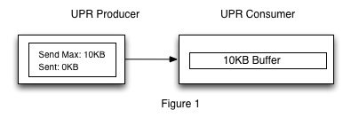
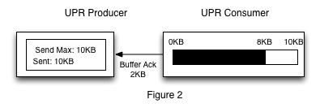

# Flow Control

In order to make sure that a Producer does not overload a Consumer with messages the DCP Protocol provides a flow control mechanism so that the Producer can control the amount of data that is sent to the Consumer. This flow control algorithm works by using a windowing mechanism where the window size is specified in bytes by the Consumer. Flow control will be available to the Consumer on both a per connection and a per stream basis. While it will be possible to use both mechanisms at the same time it is not recommended, due to the added complexity on the Consumer side.

**Note:** Current versions of Couchbase only support connection based flow control.

### High Level Flow Control Behavior

When a Consumer wants to use flow control it does so by specifing the buffer size it has available in bytes to the Producer. Specifying 0 indicates that flow control will not be used and that the Producer is free to send data to the Consumer as soon as the Producer can send it. If the Producer receives a non-zero buffer size then it will keep a series of stats to track how much data has been sent to the Consumer in order to control the amount of messages it sends. An example of a connection that is set up using flow control is below.

Figure 1 above shows a Producer and Consumer that are using flow control. The figure shows a Consumer that has specified a 10KB buffer to the Producer and that the Producer has not sent any messages yet. On the Producer side of the connection we keep information on how much data has been sent to the Consumer and the maximum amount of data that can be sent. This information is used to make decisions on whether or not the Producer can send the next item. On the Consumer side of the connection the Consumer will allocate a buffer based on the buffer size it told the server it had.

The Producer will continue to send messages to the Consumer as long as there is any available space in the Consumers buffer. This means that the Consumer must be prepared for a message that will potentially overflow its buffer. The reason the Consumer must be prepared for this is that the Consumer is allowed to specify its buffer size to be less than the maximum item size. As a result it is possible that the server may send an item that would not fit into the Consumers buffer even if the Consumers buffer were empty.

Once the Producer fills the Consumers buffer the Producer will put the connection to sleep and wait until the Consumer signals that it has successfully processed some of the messages it has received and that the Consumer has more space in it’s buffer to receive messages. The Consumer does this by sending a [Buffer Acknowledgement](commands/buffer-ack.md) message that contains the amount of buffer space that it has freed. When the Producer gets a [Buffer Acknowledgment](commands/buffer-ack.md) message the Producer will decrement the amount of bytes sent to the Consumer by the amount of bytes specified in the [Buffer Acknowledgment](commands/buffer-ack.md).

The Producer will then check to see if there is any room in the Consumers buffer and if there is then it will send the next message it has. Figure 2 below shows an example Producer that cannot send any more message and a Consumer that is in the process of telling the server that it has freed up 2KB of space in its buffer. In this case after the Producer receives the [Buffer Acknowledgment](commands/buffer-ack.md) it will continue to send more messages.

### Per Connection Flow Control Example

1. The Consumer creates a connection with the Producer by sending an [Open Connection](commands/open-connection.md) message. To establish flow control the Consumer will then send a [Control](commands/control.md) message. This message should specify that the consumer wants to use a per connection buffer by specifying the parameter “connection_buffer_size” in the key section and the buffer size in the value section of the [Control](commands/control.md) message. In this example the buffer size will be 102400 (100KB).

2. The Consumer will then start opening streams so that is can receive data from the server. For this example assume the Consumer opens two streams with the Producer. Since we already have flow control set up on the connection level flow control is handled automatically by the connection for these streams.

3. The Producer quickly sends 100KB worth of messages to the Consumer and the Consumers buffer is filled up. The Producer will now wait until the Consumer indicates it has more space for items.

4. Some time later the Consumer has processed 40KB of data and it wants to notify the Producer that it can accept more items. The Consumer sends a [Buffer Acknowledgement](commands/buffer-ack.md) and indicts in the message that it has processed 40KB of data. This message should also contain an opaque value of 0 to indicate that the acknowledgement is for connection level flow control. This opaque value will be reserved solely for this purpose.

5. The Producer processes the message and decrements the byte count of the amount of data that has been sent, but not acknowledged.

6. The Producer will then continue to send data until it reaches the maximum send size.

7. Steps 4-6 continue until the connection is closed.

### Per Stream Flow Control Behavior

**Note:** Couchbase does not currently support stream based flow control

1. The Consumer creates a connection with the Producer and sends an [Open Connection](commands/open-connection.md) message. The Consumer then sends a [Control](commands/control.md) message to indicate per stream flow control. This messages will contain “stream_buffer_size” in the key section and the buffer size the Consumer would like each stream to have in the value section. In this example the stream buffer size will be set to 10240 (10KB).

2. The Consumer will then start opening streams so that is can receive data from the server. For this example assume the Consumer opens two streams with the Producer. Since the stream buffer size was set to 10KB each stream will stop sending message once this value is reached.

3. The Producer quickly sends 10KB worth of messages for each stream to the Consumer and the Consumers buffers are filled up. The Producer will now wait until the Consumer indicates it has more space for items on each of the buffers.

4. Some time later the Consumer has processed 5KB of data from one of the streams and it wants to notify the Producer that it can accept more items. The Consumer sends a [Buffer Acknowledgement](commands/buffer-ack.md) and indicts in the message that it has processed 5KB of data and sets the opaque field of this message to the opaque used for this stream.

5. The Producer processes the message and decrements the byte count of the amount of data that has been sent only for the stream that has more buffer space available.

6. The Producer will then continue to send data for the stream that has buffer space available until it reaches the maximum send size. The other stream which has not had its data processed will not send any new data.

7. Steps 4-6 continue until the connection is closed.

### Consumer-Side Buffer Advertising

The Producer will not specifically request [Buffer Acknowledgement](commands/buffer-ack.md) messages for any mutations or at any intervals of time. Decisions about when to send [Buffer Acknowledgement](commands/buffer-ack.md) messages is up to the Consumer. It is recommend however that Consumers send an acknowledgement after 50KB or 20% of the buffer has been processed.

### Large items

Couchbase allows a maximum data size of 20MB which means a client must be ready to receive an item of this size. Consumers will rarely want to keep stream buffers of this size since this would mean the application would need to reserve 20MB * 1024 Vbuckets or 20GB of buffer space if they stream all VBuckets. In order to deal with this issue Consumers must be aware that their code will need to be able to handle recieving items that will overflow their buffers. The Producer will continue to send items as long as there is any space available in the Consumers buffer no matter what the size of the item.

### Setting 0 Buffer Size

Setting the buffer size for a stream to zero is a special case for flow control. This means that the connection or streams will not use any flow control.

### Buffering Messages

Only Mutation, Deletion, Expiration, Snapshot Markers, Set VBucket State, and Stream End messages should be buffered. All other messages should be processed immediately and should not be counted as taking up buffer space. This is important because DCP connections should always be able to process [No-op](commands/no-op.md) messages quickly. Other messages like [Control](commands/control.md) messages do not take up significant memory space and can be applied immediatley without having to take up buffer space.

## Flow control policies in DCP Consumer (replica connection) on Couchbase Data Nodes
There are 4 different types are of flow control policies that are supported by DCP consumers on couchbase data nodes. They are **(1) none (2) static (3) dynamic (4) aggressive**. One of these policies can be chosen by setting it in the configuration file.  The DCP consumers on couchbase data nodes are created for data replication from active to replica vbuckets.

Below is the description of each of the 4 policies:
### None:
No flow control policy is adopted. Consumer will advertize the buffer size as 0 to the Producer.
### Static
In this policy all flow control buffer sizes are fixed to a particular value. This value is a configurable. By default it is 10MB.
### Dynamic
In this policy flow control buffer sizes are set only once during the connection set up. It is set as a percentage (default 1) of bucket mem quota and also within max (default 50MB) and a min value (default 10 MB). Once dynamic flow control buffer memory usage goes beyond a threshold (10% of bucket memory), all subsequent connections get a flow control buffer size of min value (default 10MB)
### Aggressive
In this policy flow control buffer sizes are always set as a percentage (default 5%) of bucket memory quota across all flow control buffers, but within max (default 50MB) and a min value (default 10 MB). Every time a new connection is made or a disconnect happens, flow control buffer size of all other connections is changed to share an aggregate percentage(default 5%) of bucket memory
