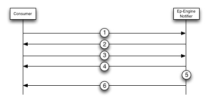

# Notifier Connection

**Note** The notifier connection is intended for internal use only and may be removed at any time. It is currently considered deprecated.

In order to provide a Notification API, DCP implements a connection type called a notifier connection which has different behavior than the typical Consumer and Producer connections. The purpose of this connection is to relay notifications about data becoming available for a Consumer to stream.

To use the Notification API a Consumer will begin by creating a notifier connection. Since the Consumer knows the last sequence number it has received for each VBucket it can ask the server to notify it when new mutations are available by specifying the sequence number that the Consumer has last received as well as the corresponding VBucket ID. A notifier connection will never send items, but instead keep the stream open until a new item is received for that VBucket. When this happens the stream will be closed signifing to the Consumer that new items are ready to be streamed. The Consumer can then create a normal producer connection and request a stream containing the latest items.

### Message Flow

Below is a diagram and description of how a notifier connection can be used in order to receive notifications about items becoming ready for a specific VBucket.

1. The Consumer will establish a connection with the server and send an [Open Connection](commands/open-connection.md) message specifying that the connection will be an notifier connection. This is specified by supplying the *DCP Notifier Connection Flag (0x02)* in the flags field of the [Open Connection](commands/open-connection.md) message.

2. The server will respond with a message indicating that the notifier connection has been created.

3. The Consumer will then send a [Stream Request](commands/stream-request.md) message to the server. This message will contain the last mutation seen by the Consumer for a particular VBucket as well as the VBucket ID. The *Start Sequence Number* field of the [Stream Request](commands/stream-request.md) message will be used to specify the sequence number of the last mutation number seen and the Consumer should set the *VBucket UUID* to the latest entry in the Consumers failover log. The *End Sequence Number* will not be used and can just be set to 0.

4. The server will return a message indicating that the Stream Request was successful.

5. The stream will remain open until a mutation containing a sequence number higher than the one specified in the Start Sequence Number field of the [Stream Request](commands/stream-request.md).

6. Once a higher sequence number than the sequence number specified in the Start Sequence Number field is received for the VBucket the stream was created for the server will send the Consumer a [Stream End](commands/stream-end.md) message and close the stream. This [Stream End](commands/stream-end.md) message will indicate that new items are ready on the server.

### Use Cases

It is advised that applications which need to recieve a continuous stream of mutations leave their streams open indefinitely. This is achieved by setting the *End Sequence Number* field of a [Stream Request](commands/stream-request.md) to the maximum possible number. This is recommended because it will ensure that data is sent as soon as possible and won't add any overhead of frequently creating and destroying streams.

In some cases however it is not easy to just leave streams open and as a result the notification connection was added. It is currently only used in our [XDCR Integration]() and is meant to be temporary. As a result is it currently deprecated. Please refer to the XDCR use case for more information on how it can be used.

The notifier connection was intended to be an alternative to polling the server to see if new items were ready to be streamed. The approach taken here is meant to be an event based approach to reduce the performance and networking overhead polling would cause.
