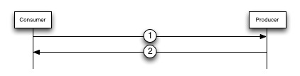
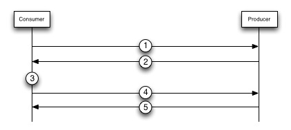
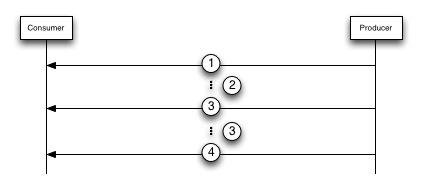

## Protocol Flow

This document intends to describe an example of the protocol flow between a Consumer and a Producer. The sections below will provide a step-by-step walk through of the messages exchanged by the Consumer and Producer for the lifetime of a connection.

##### Creating the Connection

Creating a connection consists of opening a TCP/IP socket between the Consumer and the Producer and sending an [Open Connection](commands/open-connection.md) message. This [Open Connection](commands/open-connection.md) message message signifies this connection is a DCP connection and also allows the sender to give the connection a name. Below is a diagram of the interaction between the Producer and Consumer that takes place to establish a DCP connection.

1. The Consumer will send an [Open Connection](commands/open-connection.md) message to the Producer in order to create the initial connection and assign the connection a name. The connection name can be used to get statistics about the connection state as well as other useful debugging information. If a connection already exists on the Producer with the same name then the old connection is closed and a new one is opened.

2. The Producer will respond with an *OK* message to signify that the connection was created.

Once a DCP connection is created the Consumer can configure the connection by sending [Control](commands/control.md) messages to the Producer. [Control](commands/control.md) messages can be used to do things like enable [dead connection detection](dead-connections.md) and [flow control](flow-control.md). Sending [Control](commands/control.md) is not required if the default connection settings are sufficient.

##### Starting the Stream

Once a connection has been created the Consumer can to create one or more VBucket Streams in order to stream data from Couchbase. The diagram below describes how to create a VBucket stream once a connection exists.

1. The Consumer will send a [Stream Request](commands/stream-request.md) message to the Producer. This message indicates that the Consumer wishes to receive data from the Producer for a specific VBucket. If this is the first time the Consumer is connecting to the Producer then 0 should be specified in the *Start Sequence Number*, *VBucket UUID*, *Snapshot Start Sequence Nunmber*, and *Snapshot End Sequence Number* fields to indicate that the Consumer wants to receive all data from Couchbase from the beginning of time. If it is not the first time the Consumer is connecting to the Producer then the Consumer should specify the last sequence number the Consumer received in the *Start Sequence Number* field, the most recent VBucket UUID in the Consumers failover log int the *VBucket UUID* field, and the most recent snapshot information for the *Snapshot Start Sequence Number* and *Snapshot End Sequence Number* fields. This will allow the Consumer to begin receiving data from where it last left off.

	The Producer will respond to a Stream Request with either an *Ok* message or a *Rollback* message. If the message contains a *Rollback* response then the stream behavior will resume at step 2, but if an *Ok* message is received then jump to step 5.

2. The Producer sends a Rollback response which contains a *Sequence Number* that needs to be rolled back to. This means that the Consumer and the Producer have different histories of their data and the Consumer needs to remove some of its data that the Producer doesn't have and then try to start the stream again.

3. What happens in this step depends on the application that the Consumer is streaming data for. Some applications might want to rollback some of their data and other might not care.

4. The Application then uses its new last Sequence Number and VBucket UUID and sends another Stream Request message to the Producer. The Sequence Number should be less than or equal to the Sequence number received in the Rollback message.

	It is possible if there is a failover between steps 3 and 4 that the consumer will need to rollback again. This should be rare, but if it does happen then jump back to step 2.

5. The Producer sends an *Ok* message which contains the Failover Log back to the Consumer. The Consumer should persist the Failover Log (and use the latest entry for the next request) and expect to begin receiving data from the Producer.

Starting VBucket Streams can be parallelized since the Consumer can start as many streams as it needs to. Consumers should not create a connection per VBucket Stream since this will cause heavy resource usage on the server since each connection uses a file descriptor.

##### Reading the Stream

Once a stream is started the Consumer will begin receiving data. The figure below shows what messages the Consumer should expect to receive. Fully understanding this section requires understanding what a [snapshot]() is and why snapshots are significant.

1. The first message that will be sent during a stream request is a [Snapshot Marker](commands/snapshot-marker.md). The purpose of this message is to tell the Consumer the sequence numbers that are part of the snapshot that is going to be sent by the Producer. The *Snapshot Start Sequence Number* and *Snapshot End Sequence Number* in this message should be persisted since they are required to properly restart the stream if the connection is lost.

2. After sending a [Snapshot Marker](commands/snapshot-marker.md) the Producer will send a series of [Mutation](commands/mutation.md), [Deletion](commands/deletion.md), and [Expiration](commands/expiration.md) messages that are part of the current snapshot.

	Once all of the items from the first snapshot have been sent the Producer will check to see if the sequence number of the last item sent is greater than the *End Sequence Number*. If it is then the stream will be closed. If not then more items will be sent.

3. If there are more items to send then the Producer will send another [Snapshot Marker](commands/snapshot-marker.md) followed by more [Mutation](commands/mutation.md), [Deletion](commands/deletion.md), and [Expiration](commands/expiration.md) messages.

4. At some point however the VBucket stream will be finished and the Producer will send a [Stream End](commands/stream-end.md) message to signify the stream is finished. A stream may end for different reasons so it is important to check the status code in the [Stream End](commands/stream-end.md) message.

##### Closing a Connection

When the Consumer wants to end a DCP connection it should simply close the socket. The Producer will see the connection going down and this will cause the Producer to remove any structures used for sending data to the Consumer.
