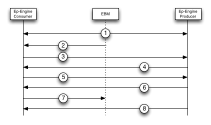
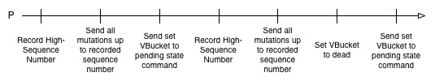
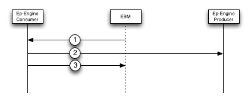

# Rebalance

A rebalance takes place in a cluster after a node is added or removed and the cluster manager needs to shift data around the cluster so that every node has roughly the same amount of data to manage. Couchbase divides its data into 1024 paritions called VBuckets. When a rebalance takes place the cluster manager will generate a map of where each VBucket should reside and then moves each VBucket to the appropriate node. Once all VBuckets have been moved to their target nodes the rebalance is complete.

At a high level a rebalance simply consists of one or more VBucket movements which take place in order enusure the data managed on each node is roughly the same. As a result this document will describe in detail the steps that take place to move a single VBucket from one node to another using the DCP protocol. A VBucket move consists of an initial connection handshake, adding/removing VBucket Streams, getting the new VBucket up to date with respect to the old VBucket, and the actual VBucket takeover. Each of these phases will be detailed in the sections below.

### Initial Stream Handshake

The diagram below shows the three entities that take part in a rebalance. The Consumer represents the new VBucket that is being created and this entity will be recieving data from the current active VBucket. The current active VBucket is represented in the diagram as the Producer and it will be the entity which sends all of its data to the consumer. The entity in the middle of the diagram is the EBucketMigrator (EBM) and it's part of the cluster manager. The EBucketMigrator is a proxy which simply monitors the Vbucket movement.

Below is the set of steps that take place when initializing the VBucket movement.

1. The EBucketMigrator will create a connection between itself and the consumer as well as a connection between itself and the producer. It will do this by sending an [open connection](commands/open-connection.md) message that contains a name for the connection. The Producer and Consumer will always have the same name and this name can be used for stats and debugging.

	**Note:** If a connection with the name given in the [open connection](commands/open-connection.md) already exists on either the producer or consumer then the previously existing connection will be closed immediately. A closed connection on the Consumer side means any incoming or unprocessed messages will be dropped by the Consumer. On the Producer side a closed connection will cause any structures used for transmitting data to be torn down. As a result the connection name will be unique and shared between both the Producer and Consumer sides of the connection. This enforces that the connection name is associated with one and only one connection.

2. The EBucketMigrator sends an [Add Stream](commands/add-stream.md) message to the Consumer. The [Add Stream](commands/add-stream.md) message simply contains the VBucket ID that the Consumer should create a stream for. The Consumer will attempt to create the stream with the Producer and will not return a response for the the [Add Stream](commands/add-stream.md) request to the EBucketMigrator until the stream handshake is complete. As a result the EBucketMigrator should expect an out of order response for this message, but can match the response with the request by looking at the opaque field.

3. In order to create the stream the Consumer will send out a [Stream Request](commands/stream-request.md) message for the VBucket that it wants to start a stream for. Each Stream Request message will contain a High Sequence Number/VBucket UUID pair that tells the Producer where the Consumer last left off in the data stream. These messages will be sent directly back to the EBucketMigrator process which will forward them to the Producer.

	The producer will respond to each [Stream Request](commands/stream-request.md) message with either an *OK* response or a *Rollback* response. If the response is a *Rollback* message then the handshake will continue from step 4, but if an *OK* response is received then the handshake continues at step 6.

4. Based on the High Sequence Number/VBucket UUID pair that was sent in the [Stream Request](commands/stream-request.md) message the Producer has decided that the Consumer must rollback its data to a specific sequence number. The Producer will respond to the Consumer by sending a Rollback response which contains the sequence number that the Consumer should roll back to.

5. When the Consumer receives a Rollback message it will rollback to at least the sequence number specified by the Producer. The Consumer will then send a new [Stream Request](commands/stream-request.md) message back to the Producer with it's new High Sequence Number/VBucket UUID which will have changed due to the rollback.

	It is possible if there is a failover between steps 4 and 5 that the Consumer will need to rollback again. This should be rare, but if it does happen then the handshake will continue at step 4.

6. Since the Consumer has rolled back its state and can resume receiving mutations from the Producer the Consumer will receives an *OK* message which will contain the Failover Log of the Producer. The Consumer should persist and overwrite its Failover Log with the one from the Producer.

	At this point the request-response pattern for a stream will change. During the handshake the Consumer made all requests, but post-handshake the Producer will make all requests since it will be sending its data to the Consumer.

7. The Consumer now sends a response for the [Add Stream](commands/add-stream.md) message back to the EBucketMigrator signifying that a VBucket stream has been successfully created.

8. The Producer will now begin to send its data to the Consumer.

### Moving Data

**TODO (Mike)** - Work with Alk to ensure this section is correct

In order to determine when the new VBucket is up to date with respect to the current active VBucket the EBucketMigrator must monitor the DCP stream for certain events to take place. Figure 3 below shows each of these events and how they can be monitored will be described below.

1. The first event that the Cluster Manager needs to determine is when the new VBucket is close to being up to date. The Cluster Manager will be able to determine this by polling [stats vbucket-takeover](commands/stats-vbucket-takeover.md). This stats call will provide an estimate of how much more data needs to be sent over a given stream before the stream is completely up to date. If there are less than 1000 items that still need to be sent the Cluster Manager can assume that the new VBucket is almost up to date with respect to the old VBucket.

2. When doing a rebalance we want to avoid the possibility of massive data loss immediately after a VBucket move. This can happen if we don’t persist everything to disk before starting the next VBucket move. As a result we should wait for persistence of a majority of the items before pausing indexing on the old VBucket. The EBucketMigrator can make sure items up to a certain sequence number are persisted by using the [Wait For Persistence](commands/persist_seqno.md) command. This command will respond with either a timeout, which tells EBucketMigrator that the items have not yet been persisted and to try the command again or a success meaning that all items up to the given sequence number are persisted.

3. The Cluster Manager will then stop the indexer on the old VBucket and get the last sequence number that has been indexed by the indexer for the old VBucket that is being moved.

4. The Cluster Manager will next poll the indexer on the node containing the new VBucket until two requirements are met. First the indexer must have  indexed a sequence number that is greater than or equal to the last sequence number indexed on the old VBucket. Second, the VBucket UUID from the old VBucket must match the VBucket UUID on the indexer to ensure that indexer contains the proper mutation history.

### VBucket Takeover

**TODO (Mike)** - Improve clarity of this section and work with Alk to make sure it is correct.

VBucket takeover is the final step of a VBucket move and it involves switching the states on the new and old VBuckets so that the new VBucket becomes the active VBucket. We describe the steps to complete the takeover below.

To initiate a VBucket Takeover the EBucketMigrator will send an [Add Stream](commands/add-stream.md) command to the memcached front end with the Takeover flag set. This message will contain the vbucket that should be taken over and will return immediately to indicate either success or failure. The VBucket stream must also already exist in order for the takeover message to succeed.
During the takeover phase the EBucketMigrator process will need to watch for [Set VBucket State](set-vbucket-state.md) messages which will be sent twice during the takeover process. When the takeover begins the producer will record its high sequence number and send all of the messages it has up to that sequence number. After this the first state change message is sent to the consumer and should change the state of the VBucket on the consumer side from replica to pending state. The producer then sets its VBucket to dead state and sends all of the remaining messages to the consumer. Once all messages are sent the producer sends a second state change message which changes the VBucket on the consumer side to active state. This will be the last message sent by the producer and the EBucketMigrator process needs to make sure that this message is received and executed by the consumer. After the last [Set VBucket State](set-vbucket-state.md) message is sent then the EBucketMigrator must check the states of the buckets on both sides of the connection. If the VBucket states do not match what the EBucketMigrator expects then the EBucketMigrator must change the states back to their original states (before the takeover) and start the takeover process again.

### Closing Streams

Under certain circumstances the Cluster Manager might need to stop some streams pre-maturely. This can happen if the rebalance is stopped before it completes and will also happen if the Cluster Manager needs to stop any currently running replications. This section details the best practices for closing replication streams.

To close a VBucket Stream the EBucketMigrator will send a [Close Stream](commands/close-stream.md) message containing the VBucket ID of the stream to both sides of the connection. This means one [Close Stream](commands/close-stream.md) message is sent to the Consumer and another [Close Stream](commands/close-stream.md) is sent to the Producer. The Consumer will immediately close it’s connection and refuse to process any other message that may already be on the wire for that stream. The Producer will place an [Stream End](commands/stream-end.md) message into it’s send queue and mark the connection dead. All [Close Stream](commands/close-stream.md) messages will return responses to the EBucketMigrator immediately and the response can be mapped to the request by using the opaque field.

### Example VBucket Move

**TODO (Mike)** - Improve clarity of this section.

Doing a VBucket Move can be accomplished by following the steps in the sections above. The first step is to create a connection between the EBucketMigrator and both the producer and consumer Couchbase Servers. This can be accomplished by following the steps in the Initial Stream Section above. Upon completion of those steps you will have a named connection and a single VBucket Stream being sent over that connection. At this point the EBucketMigrator can continue adding streams to the connection by sending more [Add Stream](commands/add-stream.md) commands. Note that all streams will be sent over the same connection and that it is considered bad practice to have a connection per stream. The reason that it’s bad practice to have a stream per connection is because there are a limited number of connections that can be used by memcached (10,000 total, 1,000 for replication/rebalance) so the fewer connections that are used the better. This is especially important when you take into account that a connection can potentially have 1024 streams.
At this point the Cluster Manager will choose a VBucket that it wants to move to another node. Although there may be many VBucket Streams on the connection the EBucketMigrator will likely only be moving a few of the VBuckets. The section titled Moving Data provides details on how the EBucketMigrator can track the progress of data moving. Once the steps in this section are finished then both the new and old VBuckets are considered up to date. After this the EBucketMigrator can convert the VBucket Stream to a takeover stream and this is outlined in the Takeover section. After the takeover process the VBucket can be considered moved to the next node and the stream is removed from the connection. The Cluster Manager can begin the next VBucket Move.
