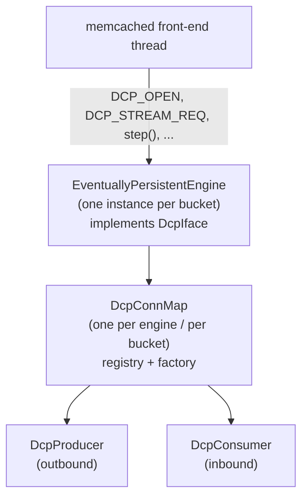
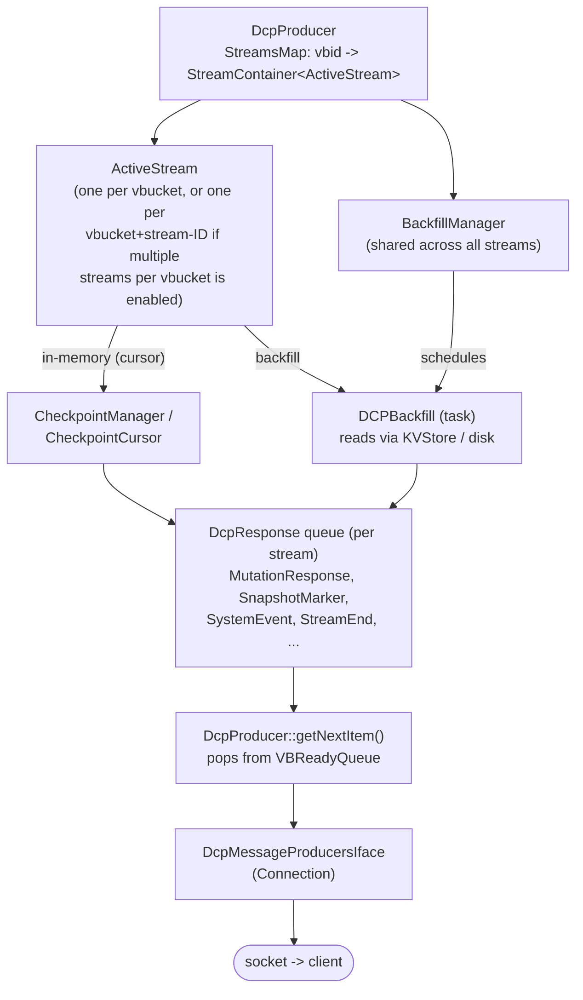
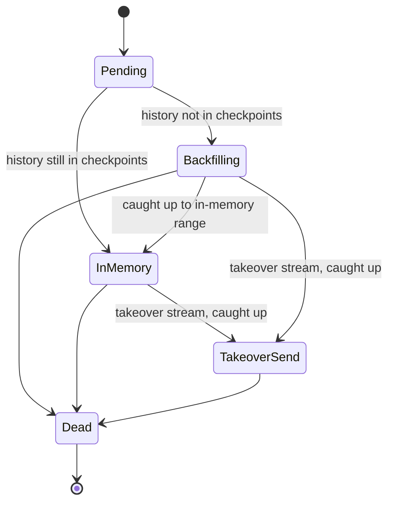
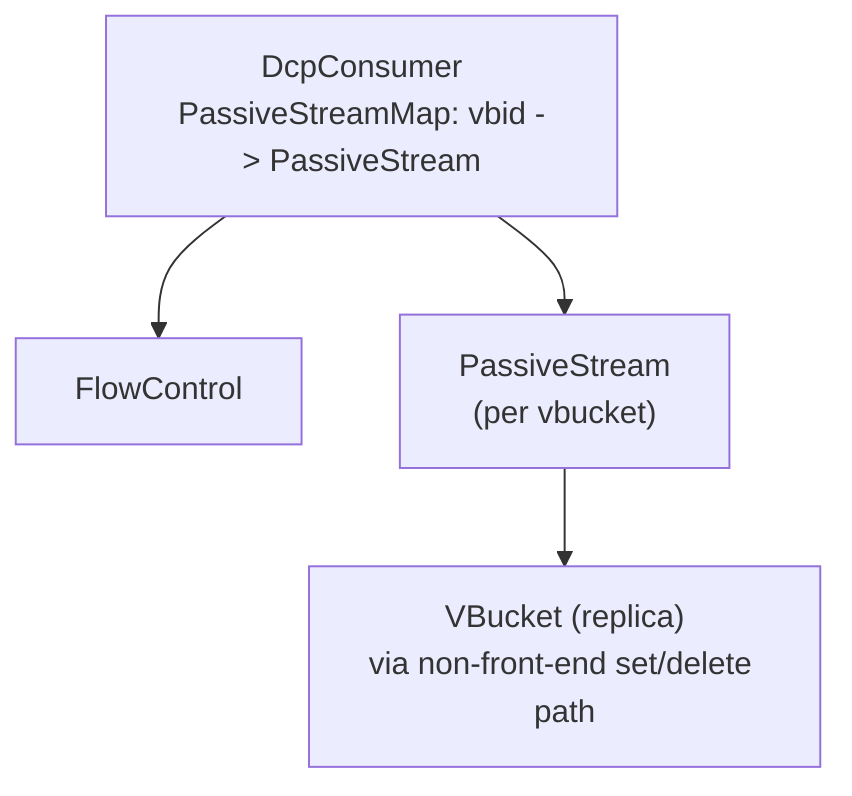

# Server Design

This page describes how DCP is implemented on the server side inside
`kv_engine`/`ep-engine` - the C++ classes involved, how they relate to each
other, and how a byte written by a client eventually reaches a DCP consumer
over
the wire. It complements [Concepts](concepts.md) (which describes DCP from a
protocol/client point of view) with the internal component map.

### Connection Registry

Each bucket is served by one `EventuallyPersistentEngine` instance, and each
engine owns exactly one `DcpConnMap` (`engines/ep/src/dcp/dcpconnmap.h`).
`DcpConnMap` is the registry of every DCP connection open against that bucket,
and the factory that creates a `DcpProducer` or `DcpConsumer` when a client
sends `DCP_OPEN`. Both classes derive from the common `ConnHandler` base
(`engines/ep/src/connhandler.h`).

### Producer Side

A `DcpProducer` (`engines/ep/src/dcp/producer.h`) represents one outbound DCP
connection - the server acting as a source of mutations for a replica, XDCR,
GSI, backup, or any other DCP client. It owns:

* a `StreamsMap` mapping vbucket id -> `StreamContainer<ActiveStream>` -
  normally one `ActiveStream` (`active_stream.h`) is created per vbucket the
  client has requested a stream for, but if the client opened the connection
  with multiple-streams-per-vbucket enabled (`DCP_OPEN_FLAG_STREAM_ID` /
  `enable_stream_id`), each `DCP_STREAM_REQ` is tagged with a
  [stream-ID](commands/stream-request-value.md#sid) (`sid`) and the
  `StreamContainer` can hold several concurrent `ActiveStream`s for the same
  vbucket, one per `sid`;
* a `VBReadyQueue` ("ready queue") of vbucket ids that currently have a
  response
  waiting to be sent;
* a `BackfillManager` (`backfill-manager.h`), shared by all of that producer's
  streams, which throttles and schedules disk backfills against `KVStore`;
* an `ActiveStreamCheckpointProcessorTask`, which drains `CheckpointCursor`s
  for
  in-memory streams off a background thread rather than the front-end thread -
  though this is conditional: if the stream's configuration means item values
  won't need modifying (e.g. no compression or xattr stripping is required, so
  the value can ship as-is) and the checkpoint only has a small number of
  pending items, the extraction is done inline on the calling thread instead of
  dispatching the task.

**Choosing in-memory vs. backfill.** When a stream is opened,
`ActiveStream::scheduleBackfill_UNLOCKED` registers a cursor against the
vbucket's `CheckpointManager` at the requested start sequence number. If the
requested history is still present in a checkpoint, the cursor registration
succeeds and the stream goes straight to `StreamState::InMemory`, pulling items
directly off that `CheckpointCursor`. If the history has already been
de-duplicated/expelled from checkpoints, registration reports that a
backfill is required, and a `DCPBackfill` task is scheduled to read the
missing range from `KVStore` (disk) - or, for ephemeral buckets, from the
in-memory sequence list - before the stream transitions to `InMemory` for
anything newer. This is why a
single stream can legitimately mix a disk snapshot followed by a point-in-time
(checkpoint) snapshot: `ActiveStream` state moves `Pending -> Backfilling ->
{InMemory | TakeoverSend} -> Dead`.

See [Concepts](concepts.md#snapshots) for what this looks like from the
protocol/client side, and [Statistics](statistics.md#producer-active-stream)
for
the per-stream `state` and `cursor_registered` fields that expose this state
machine at runtime.

`ProducerStream` (`producer_stream.h`) is the common base for two sibling
stream
types the producer can create: `ActiveStream`, described above, and
`CacheTransferStream` ([Cache Transfer](cache-transfer.md)), which streams a
vbucket's resident item cache to a specific consumer type rather than mutations
off a checkpoint cursor or backfill. [Rebalance](rebalance.md) is a separate,
client-visible protocol sequence (via the legacy EBucketMigrator) that
drives an `ActiveStream`/`PassiveStream` pair through takeover rather than a
different internal mechanism.

### Notification

DCP is driven by the front-end thread calling `DcpIface::step()` in a loop;
there is no dedicated DCP thread per connection. When an `ActiveStream` or a
backfill task has something to send, it pushes the vbucket id onto the
producer's `VBReadyQueue` and calls `ConnHandler::scheduleNotify()`, which asks
the connection to be re-woken (`scheduleDcpStep()`), causing the front-end
thread to invoke `step()` again and drain the queue via
`DcpProducer::getNextItem()`. Backfills themselves run asynchronously on the
`BackfillManagerTask` (`AUXIO` thread pool), and checkpoint draining for
in-memory streams runs on `ActiveStreamCheckpointProcessorTask` (`NONIO` thread
pool) - both feed the ready queue rather than writing to the socket directly.

### Consumer Side

A `DcpConsumer` (`engines/ep/src/dcp/consumer.h`) represents one inbound DCP
connection - always a replica receiving mutations from an active vbucket. It
owns a `PassiveStreamMap` (vbucket id -> `PassiveStream`) and a `FlowControl`
object that tracks the buffer size this consumer has advertised to its
producer and acks bytes as they're consumed. Buffer sizing is decided
per-connection by a `DcpFlowControlManager` owned by the engine.

Vbuckets themselves do not hold references back to the streams reading or
writing them; when a vbucket's state changes (e.g. during failover or
rollback),
`DcpConnMap` walks its registered connections to find and notify the affected
`ActiveStream`/`PassiveStream` objects, rather than the vbucket pushing the
notification itself.
