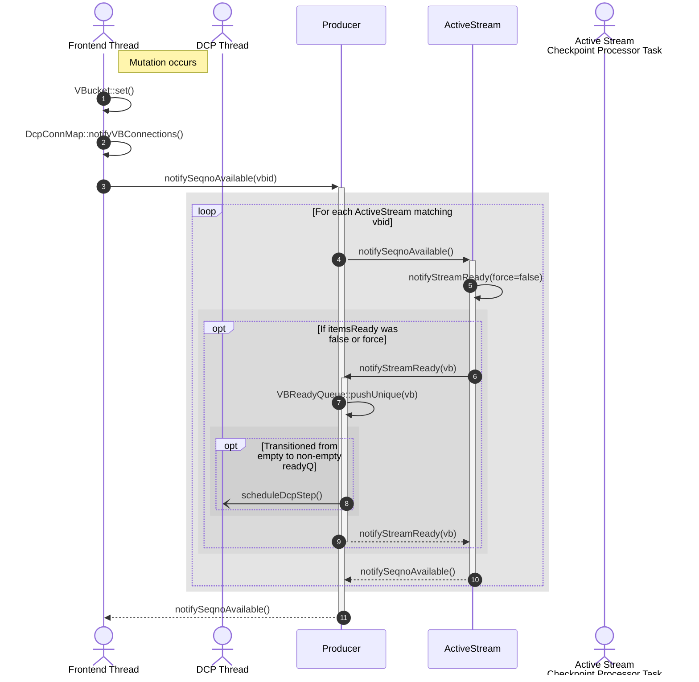
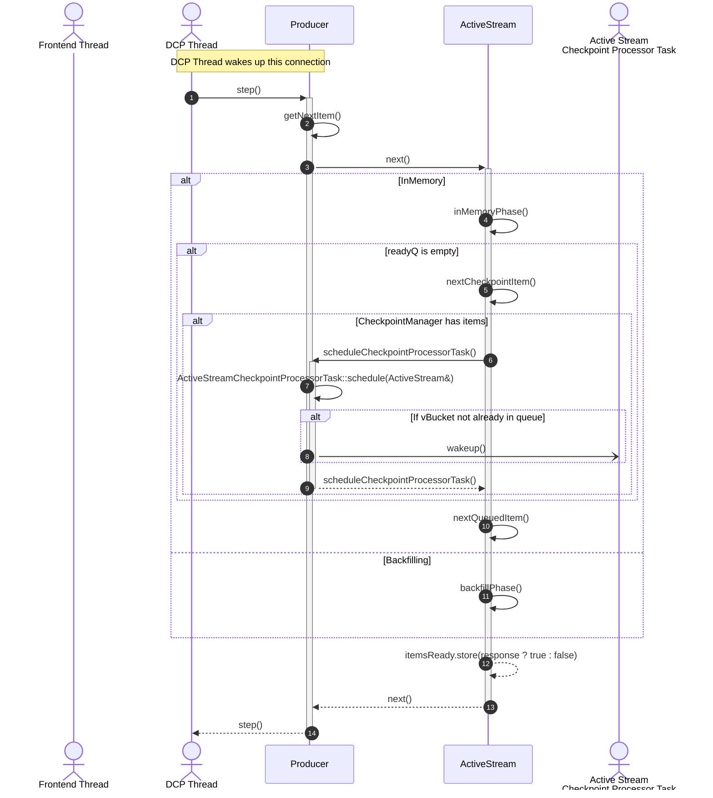
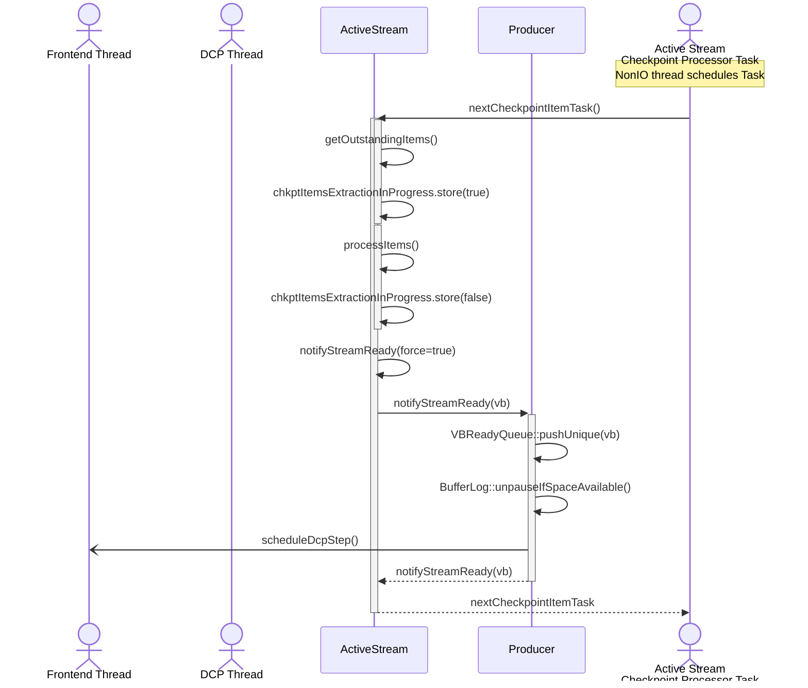

# DCP Sequence Diagrams

This document shows the sequence of calls between the major DCP components for
the main DCP operations.

## Notifying DCP on a new sequence number

## DCP Front-end thread waking up after notification

## ActiveStreamCheckpointProcessorTask processing checkpoints

